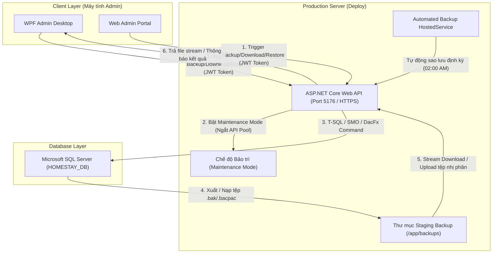

# KẾ HOẠCH CHI TIẾT: XÂY DỰNG TÍNH NĂNG SAO LƯU VÀ PHỤC HỒI CƠ SỞ DỮ LIỆU (DATABASE BACKUP & RESTORE)
> **Dự án:** Hệ thống Quản trị & Đặt phòng Homestay Stayly  
> **Áp dụng cho:** Môi trường Local Development, Máy chủ VPS độc lập, Docker Container & Môi trường Cloud sau khi Deploy  
> **Tài liệu tham chiếu:** [HOMESTAY_DB.sql](file:///d:/Homestay/HOMESTAY_DB.sql), [BaoTriHeThongViewModel.cs](file:///d:/Homestay/Wpf/HomestaySystem/HomestaySystem/ViewModels/BaoTriHeThongViewModel.cs), [HttpAdminService.cs](file:///d:/Homestay/Wpf/HomestaySystem/HomestaySystem/Services/HttpAdminService.cs)

---

## 1. TỔNG QUAN VÀ BỐI CẢNH HỆ THỐNG

### 1.1. Thực trạng hiện tại
- Phân hệ **Desktop Admin (WPF)** hiện có màn hình Bảo trì hệ thống ([`BaoTriHeThongView.xaml`](file:///d:/Homestay/Wpf/HomestaySystem/HomestaySystem/Views/BaoTriHeThongView.xaml)), tuy nhiên:
  - ViewModel đang gắn cố định đường dẫn ổ cứng cục bộ: `D:\DO_AN_HK7\KhoaLuanCuNhan\KLCN\Wpf\Backup`.
  - Service [`HttpAdminService.cs`](file:///d:/Homestay/Wpf/HomestaySystem/HomestaySystem/Services/HttpAdminService.cs) đang dùng hàm giả lập (stub delay 100ms) trả về thông báo tĩnh, chưa có API Backend tương ứng.
  - Phía **Backend API (ASP.NET Core)** chưa có controller và dịch vụ thực hiện sao lưu/phục hồi vật lý trên SQL Server.

### 1.2. Yêu cầu cốt lõi khi Deploy (Production Readiness)
Khi hệ thống đã triển khai thực tế (Deploy lên Cloud / VPS / Docker / Máy chủ Web & DB tách biệt):
1. **Admin ở xa (Remote Client):** Ứng dụng quản trị WPF hoặc Web Admin chạy trên laptop/máy tính của Admin qua mạng Internet, hoàn toàn **không có quyền truy cập ổ đĩa cục bộ của máy chủ cơ sở dữ liệu**.
2. **Khả năng tải về (Download Off-site):** Admin có thể kích hoạt sao lưu trên server và tải tệp `.bak` về lưu trữ an toàn trên máy tính cá nhân hoặc Cloud Storage.
3. **Khả năng khôi phục từ xa (Remote Restore):** Admin có thể chọn phục hồi từ một bản backup có sẵn trên server hoặc upload một file `.bak` từ máy cá nhân lên server để khôi phục.
4. **Không làm sập hệ thống (Zero-Crash & Connection Handling):** Việc khôi phục database đòi hỏi quyền truy cập độc quyền (`SINGLE_USER`), cần cơ chế ngắt kết nối an toàn của API pool và chuyển sang chế độ bảo trì (Maintenance Mode) tạm thời.

---

## 2. NHỮNG THÁCH THỨC KỸ THUẬT VÀ GIẢI PHÁP ĐỒNG BỘ



### 2.1. Thách thức 1: Vị trí lưu trữ tệp sao lưu giữa Web API và SQL Server
- **Vấn đề:** Lệnh `BACKUP DATABASE ... TO DISK = '...'` được thực thi bởi tiến trình SQL Server service (`NT SERVICE\MSSQLSERVER`), nên đường dẫn DISK phải nằm trên **hệ thống tệp cục bộ mà SQL Server có quyền ghi**, không phải máy của Admin.
- **Giải pháp khi Deploy:**
  - **Trường hợp API và SQL Server cùng máy chủ (hoặc dùng Docker Compose):** Thiết lập một thư mục chuẩn hóa trên server (ví dụ: `C:\Stayly\Backups` trên Windows hoặc `/var/opt/mssql/backup` được mount shared volume trong Docker).
  - **Trường hợp API và SQL Server khác máy (Azure SQL / Managed DB):** Áp dụng giải pháp **BACPAC (Microsoft.SqlServer.DacFx)**, xuất trực tiếp dữ liệu dạng luồng nhị phân (Binary Stream) qua giao thức TDS của kết nối ADO.NET mà không cần ghi file vật lý trên đĩa của SQL Server.

### 2.2. Thách thức 2: Khóa kết nối (Active Connections) khi Phục hồi CSDL
- **Vấn đề:** Khi Web API và các dịch vụ nền đang chạy, Entity Framework Core duy trì một Connection Pool mở tới `HOMESTAY_DB`. Lệnh `RESTORE DATABASE` sẽ thất bại ngay lập tức với lỗi `Exclusive access could not be obtained because the database is in use`.
- **Giải pháp:**
  1. API kích hoạt cờ **`IsMaintenanceMode = true`**; mọi request từ khách hàng/chủ nhà sẽ nhận mã HTTP 503 ("Hệ thống đang bảo trì dữ liệu trong ít phút").
  2. Xóa sạch kết nối EF Core: Gọi `SqlConnection.ClearAllPools()`.
  3. Lệnh T-SQL đổi DB sang chế độ đơn người dùng với tùy chọn cắt đứt tức thì:
     ```sql
     USE master;
     ALTER DATABASE [HOMESTAY_DB] SET SINGLE_USER WITH ROLLBACK IMMEDIATE;
     RESTORE DATABASE [HOMESTAY_DB] FROM DISK = @BackupFilePath WITH REPLACE;
     ALTER DATABASE [HOMESTAY_DB] SET MULTI_USER;
     ```
  4. Sau khi phục hồi thành công, tắt chế độ Maintenance Mode và khởi tạo lại kết nối DbContext.

### 2.3. Thách thức 3: Dung lượng tệp lớn và giới hạn Timeout / Upload
- **Vấn đề:** Cơ sở dữ liệu chứa nhiều hình ảnh, hóa đơn và lịch sử đặt phòng có thể nặng từ vài trăm MB đến vài GB. Request upload/download thông thường sẽ bị ngắt do `MaxRequestBodySize` (mặc định 30MB) hoặc timeout 60 giây.
- **Giải pháp:**
  - Kích hoạt tính năng nén native của SQL Server: `WITH COMPRESSION` (giảm 70-80% dung lượng tệp `.bak`).
  - Cấu hình Kestrel trong API: Tăng `MaxRequestBodySize` cho riêng endpoint upload backup lên 500MB hoặc 1GB:
    ```csharp
    [RequestSizeLimit(1_073_741_824)] // 1 GB
    [RequestFormLimits(MultipartBodyLengthLimit = 1_073_741_824)]
    ```
  - Trả về tệp download dưới dạng **Chunked File Stream** (`FileStreamResult`) giúp tiết kiệm RAM máy chủ.

### 2.4. Thách thức 4: An toàn & Phân quyền bảo mật cao nhất (Zero-Trust)
- **Vấn đề:** File backup chứa toàn bộ thông tin nhạy cảm (mật khẩu băm, email, số điện thoại, số CCCD, tài khoản ngân hàng, thông tin doanh thu). Nếu lộ endpoint này, kẻ gian có thể đánh cắp toàn bộ hệ thống hoặc ghi đè phá hoại CSDL.
- **Giải pháp:**
  - Yêu cầu xác thực nghiêm ngặt: Chỉ vai trò **`ADMIN`** (hoặc gán thêm quyền đặc biệt `SUPER_ADMIN`).
  - Xác thực 2 bước khi Restore: Yêu cầu Admin phải nhập lại mật khẩu tài khoản quản trị + xác nhận tên CSDL (`HOMESTAY_DB`) trước khi tiến hành ghi đè dữ liệu.
  - Ghi Log kiểm toán (Audit Trail) bất biến vào cơ sở dữ liệu và file log: Ghi lại `AdminId`, `IPAddress`, `Action (Backup/Restore/Delete)`, `FileName`, `Timestamp`, và `Result`.

---

## 3. THIẾT KẾ KIẾN TRÚC VÀ CÁC THÀNH PHẦN KỸ THUẬT

### 3.1. Danh mục API Endpoints (`api/admin/database`)

| Phương thức | Đường dẫn Endpoint | Mô tả chức năng | Quyền hạn |
| :--- | :--- | :--- | :--- |
| `GET` | `/api/admin/database/backups` | Lấy danh sách các bản backup hiện có trên server (Tên, ngày tạo, kích thước MB). | `ADMIN` |
| `POST` | `/api/admin/database/backup` | Tạo bản sao lưu mới ngay lập tức (On-demand backup). Hỗ trợ đặt tên ghi chú. | `ADMIN` |
| `GET` | `/api/admin/database/backups/{fileName}/download` | Stream tải tệp `.bak` từ server về máy tính của quản trị viên. | `ADMIN` |
| `POST` | `/api/admin/database/restore/server-file` | Phục hồi CSDL từ một tệp `.bak` đã có sẵn trên máy chủ. | `SUPER_ADMIN` + Nhập mật khẩu |
| `POST` | `/api/admin/database/restore/upload` | Upload tệp `.bak` từ máy cá nhân lên server và tiến hành phục hồi. | `SUPER_ADMIN` + Nhập mật khẩu |
| `DELETE` | `/api/admin/database/backups/{fileName}` | Xóa một bản sao lưu cũ trên server để giải phóng dung lượng đĩa. | `ADMIN` |
| `GET` | `/api/admin/database/status` | Xem trạng thái CSDL: dung lượng Data (MDF), dung lượng Log (LDF), số lượng bảng. | `ADMIN` |
| `GET/PUT` | `/api/admin/database/schedule` | Xem và cập nhật lịch sao lưu tự động (Giờ chạy, số bản lưu trữ tối đa). | `ADMIN` |

---

### 3.2. Cấu trúc Mô hình DTOs (Data Transfer Objects)

```csharp
namespace API.DTOs.Database;

public sealed record BackupItemDto(
    string FileName,
    long SizeInBytes,
    string FormattedSize,
    DateTime CreatedAt,
    bool IsAutomated
);

public sealed record CreateBackupRequest(
    string? Description = null,
    bool Compress = true
);

public sealed record RestoreServerFileRequest(
    string FileName,
    string AdminPasswordConfirmation,
    string ConfirmDatabaseName // Phải gõ đúng "HOMESTAY_DB"
);

public sealed record DatabaseStatusDto(
    string DatabaseName,
    string ServerVersion,
    decimal DataSizeMB,
    decimal LogSizeMB,
    int TotalTables,
    DateTime? LastBackupDate
);

public sealed record BackupScheduleConfig(
    bool IsEnabled,
    string CronExpression, // Mặc định "0 2 * * *" (2h sáng mỗi ngày)
    int RetentionDays      // Mặc định lưu 14 ngày
);
```

---

## 4. CHI TIẾT TRIỂN KHAI PHÍA BACKEND (ASP.NET CORE)

### 4.1. Giao diện dịch vụ `IDatabaseMaintenanceService`

```csharp
namespace API.Services.Database;

public interface IDatabaseMaintenanceService
{
    Task<IReadOnlyList<BackupItemDto>> GetBackupListAsync(CancellationToken cancellationToken = default);
    Task<BackupItemDto> CreateBackupAsync(string? description, bool compress, CancellationToken cancellationToken = default);
    Task<Stream> GetBackupStreamAsync(string fileName, CancellationToken cancellationToken = default);
    Task<bool> RestoreFromExistingFileAsync(string fileName, CancellationToken cancellationToken = default);
    Task<bool> RestoreFromUploadAsync(Stream fileStream, string fileName, CancellationToken cancellationToken = default);
    Task<bool> DeleteBackupAsync(string fileName, CancellationToken cancellationToken = default);
    Task<DatabaseStatusDto> GetDatabaseStatusAsync(CancellationToken cancellationToken = default);
    Task CleanOldBackupsAsync(int retentionDays, CancellationToken cancellationToken = default);
}
```

### 4.2. Cơ chế thực thi T-SQL an toàn trong Service

```csharp
// Logic tạo bản sao lưu có nén dữ liệu:
var backupFileName = $"HOMESTAY_DB_Backup_{DateTime.UtcNow:yyyyMMdd_HHmmss}.bak";
var backupFilePath = Path.Combine(_backupDirectory, backupFileName);

var sql = $@"
    BACKUP DATABASE [{_dbName}] 
    TO DISK = @path 
    WITH FORMAT, MEDIANAME = 'StaylyBackupMedia', NAME = @name, COMPRESSION, STATS = 10;
";

// Logic phục hồi ngắt kết nối an toàn:
var restoreSql = $@"
    USE master;
    ALTER DATABASE [{_dbName}] SET SINGLE_USER WITH ROLLBACK IMMEDIATE;
    RESTORE DATABASE [{_dbName}] FROM DISK = @path WITH REPLACE, STATS = 10;
    ALTER DATABASE [{_dbName}] SET MULTI_USER;
";
```

### 4.3. Dịch vụ tự động hóa chạy nền (`AutomatedBackupHostedService`)
- Kế thừa `BackgroundService` trong `API/Services/Background/`.
- Kiểm tra theo chu kỳ hẹn giờ (mỗi ngày vào lúc 02:00 sáng - giờ máy chủ ít người truy cập nhất).
- Tự động gọi `CreateBackupAsync(description: "Auto-Scheduled Backup")`.
- Tự động dọn dẹp các tệp cũ hơn thời hạn quy định (`CleanOldBackupsAsync(retentionDays: 14)`).

---

## 5. THIẾT KẾ GIAO DIỆN QUẢN TRỊ TRÊN DESKTOP ADMIN (WPF)

Màn hình [`BaoTriHeThongView.xaml`](file:///d:/Homestay/Wpf/HomestaySystem/HomestaySystem/Views/BaoTriHeThongView.xaml) sẽ được nâng cấp giao diện chuẩn Material/Modern UI với 3 khối chức năng chính:

### 5.1. Khối 1: Thẻ trạng thái Database (KPI Status Cards)
- **Tên CSDL:** `HOMESTAY_DB` (Trạng thái: Hoạt động bình thường / Đang sao lưu).
- **Dung lượng CSDL:** ~`xx.x MB` Data + `xx.x MB` Log.
- **Thời điểm sao lưu gần nhất:** Hiển thị thời gian định dạng tiếng Việt.
- **Số bản sao lưu hiện có trên máy chủ:** `X` bản (Tổng dung lượng lưu trữ `Y MB`).

### 5.2. Khối 2: Bảng danh sách các bản sao lưu trên Server (DataGrid)
- Các cột: **Tên tệp (.bak)** | **Kích thước** | **Ngày tạo** | **Loại (Tự động / Thủ công)** | **Thao tác**.
- Nút hành động trực tiếp trên từng hàng:
  - 📥 **Tải về máy (.bak):** Mở hộp thoại `SaveFileDialog` trên máy cá nhân của Admin để tải file từ server về.
  - 🔄 **Phục hồi từ bản này:** Mở hộp thoại xác nhận bảo mật cao để restore CSDL máy chủ về mốc thời gian này.
  - 🗑️ **Xóa bản sao lưu:** Xóa file trên server để tiết kiệm dung lượng đĩa.

### 5.3. Khối 3: Thao tác Sao lưu & Phục hồi mới
- **Nút "Tạo bản sao lưu ngay":**
  - Hiển thị dialog nhập ghi chú (ví dụ: "Sao lưu trước khi cập nhật tính năng mới").
  - Thanh tiến trình xoay hiển thị trạng thái `Đang sao lưu và nén dữ liệu trên server...`.
  - Thông báo thành công kèm kích thước file đã nén.
- **Nút "Phục hồi từ tệp ngoài máy tính":**
  - Mở `OpenFileDialog` cho Admin chọn file `.bak` trên laptop cá nhân.
  - Hệ thống upload dạng Stream lên server, kiểm tra tính toàn vẹn (Header Verification).
  - Yêu cầu nhập mật khẩu xác thực và gõ đúng chữ `HOMESTAY_DB`.
  - Thực hiện Restore và tải lại toàn bộ dữ liệu hệ thống.

---

## 6. KỊCH BẢN PHỤC HỒI THẢM HỌA (DISASTER RECOVERY RUNBOOK)

| Kịch bản sự cố | Hậu quả | Quy trình khắc phục chuẩn |
| :--- | :--- | :--- |
| **Lỗi thao tác dữ liệu** (Admin xóa nhầm bảng hoặc đơn hàng) | Mất mát một phần dữ liệu | 1. Mở màn hình Bảo trì WPF.<br>2. Chọn bản sao lưu gần nhất trước thời điểm thao tác sai.<br>3. Bấm **Phục hồi**, xác nhận mật khẩu.<br>4. Hệ thống hoàn tất phục hồi sau 15-30 giây. |
| **Máy chủ VPS bị lỗi ổ cứng / Ransomware** | Toàn bộ máy chủ không thể truy cập | 1. Tạo máy chủ VPS mới, cài đặt SQL Server.<br>2. Chạy file khởi tạo cấu trúc ban đầu [HOMESTAY_DB.sql](file:///d:/Homestay/HOMESTAY_DB.sql).<br>3. Dùng file backup gần nhất đã tải về máy cá nhân upload và restore qua API. |
| **Chuyển đổi hạ tầng (Deploy sang server mới)** | Cần di dời toàn bộ dữ liệu thật sang máy chủ mới | 1. Trên server cũ: Bấm **Tạo bản sao lưu ngay** và tải tệp `.bak` về máy.<br>2. Cài đặt API và SQL Server trên server mới.<br>3. Trên ứng dụng Admin kết nối server mới: Bấm **Phục hồi từ tệp ngoài** và chọn file vừa tải. |

---

## 7. KẾ HOẠCH TRIỂN KHAI THEO GIAI ĐOẠN (ROADMAP)

### 🔹 Giai đoạn 1: Backend API & Dịch vụ Cơ sở dữ liệu (Dự kiến: 2 ngày)
- [ ] Tạo thư mục `API/Services/Database/` và triển khai `DatabaseMaintenanceService.cs`.
- [ ] Viết các lệnh T-SQL nén backup, ngắt kết nối an toàn (`SINGLE_USER`) và khôi phục database.
- [ ] Xây dựng controller `DatabaseController.cs` với đầy đủ 7 endpoint chuẩn RESTful.
- [ ] Cấu hình Kestrel cho phép stream tệp kích thước lớn và bảo vệ endpoint bằng phân quyền `ADMIN`.

### 🔹 Giai đoạn 2: Cập nhật Client WPF Admin (Dự kiến: 1.5 ngày)
- [ ] Cập nhật interface [`IAdminService.cs`](file:///d:/Homestay/Wpf/HomestaySystem/HomestaySystem/Services/IAdminService.cs) với các hàm kết nối API thật.
- [ ] Triển khai các phương thức gọi HTTP trong [`HttpAdminService.cs`](file:///d:/Homestay/Wpf/HomestaySystem/HomestaySystem/Services/HttpAdminService.cs) (lấy danh sách, tạo backup, tải stream tệp, upload file restore).
- [ ] Cập nhật [`BaoTriHeThongViewModel.cs`](file:///d:/Homestay/Wpf/HomestaySystem/HomestaySystem/ViewModels/BaoTriHeThongViewModel.cs): bỏ đường dẫn hardcoded `D:\DO_AN_HK7\...`, thay bằng cơ chế chọn tệp tải về và nạp từ server.
- [ ] Thiết kế lại giao diện [`BaoTriHeThongView.xaml`](file:///d:/Homestay/Wpf/HomestaySystem/HomestaySystem/Views/BaoTriHeThongView.xaml) hiển thị bảng lịch sử bản sao lưu và dialog xác nhận an toàn.

### 🔹 Giai đoạn 3: Dịch vụ Sao lưu Tự động & Dọn dẹp Đĩa (Dự kiến: 1 ngày)
- [ ] Xây dựng `AutomatedBackupHostedService.cs` chạy nền trong API theo lịch hẹn.
- [ ] Thêm cấu hình `DatabaseBackup` trong `API/appsettings.json` (thư mục lưu trữ, giờ sao lưu, số ngày lưu trữ tối đa).
- [ ] Viết chức năng quét và xóa tự động các tệp `.bak` quá 14 ngày để chống tràn ổ cứng máy chủ deploy.

### 🔹 Giai đoạn 4: Kiểm thử Thực tế & Đóng gói (Dự kiến: 1 ngày)
- [ ] Kiểm thử tạo backup thủ công, kiểm tra tính hợp lệ của tệp `.bak` được sinh ra.
- [ ] Kiểm thử tải tệp về máy cá nhân từ xa qua HTTP Stream.
- [ ] Kiểm thử nạp tệp và khôi phục khi đang có kết nối truy cập từ Web client.
- [ ] Kiểm tra cơ chế tự động phục hồi kết nối EF Core sau khi restore.
- [ ] Cập nhật tài liệu kiểm thử và hướng dẫn vận hành vào [`UPDATES.md`](file:///d:/Homestay/UPDATES.md).

---
*Kế hoạch này đảm bảo tính năng Sao lưu & Khôi phục CSDL hoạt động ổn định, an toàn và độc lập tuyệt đối với môi trường triển khai thực tế.*
